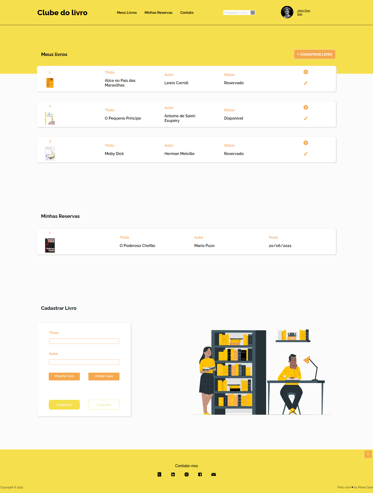
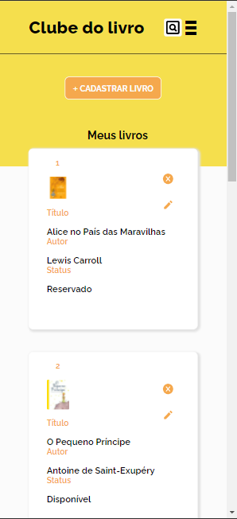
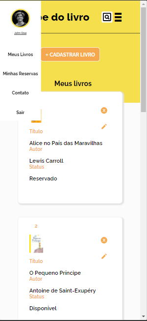
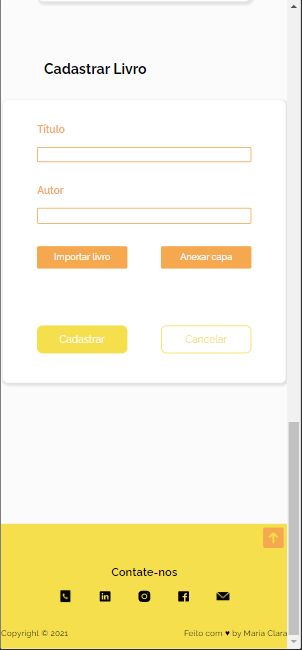

# Clube do Livro
>Teste Front-End WD7

## 💻 Sobre o projeto

Front-End de um projeto CRUD chamado Clube do Livro. 

## 🛠 Tecnologias
- HTML 
- CSS
- Javascript
- JQuery

## 🎨 Layout
[Link do Design](https://www.figma.com/file/7stdupQw86ripHYtunBnDO/Clube-do-livro?node-id=0%3A1)

### Desktop

### Mobile

## 🔎Utilitários
- Protótipo: [Figma](https://www.figma.com/community)
- Editor: [Visual Studio Code](https://code.visualstudio.com/)
- Fonte: Raleway
- Ilustração: [Storyset](https://storyset.com/)
- Foto de Perfil: [Canva](https://www.canva.com/)
- Teste de Responsividade: [Responsive Viewer](https://chrome.google.com/webstore/detail/responsive-viewer/inmopeiepgfljkpkidclfgbgbmfcennb) e DevTools
- ícones: [Icons8](https://icons8.com.br/)
- Paleta de Cores: [Coolors](https://coolors.co/f5a84d-f5df4d-fbfbfb-ffffff-000000)
- Menu-Responsivo: [bigSlide.js](http://ascott1.github.io/bigSlide.js/)

